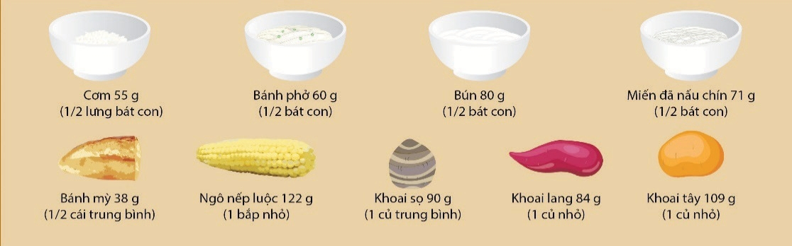

Hệ thống chuyển đổi thực phẩm được xây dựng trên cơ sở nhóm các thực phẩm có giá trị năng lượng hoặc số lượng các chất dinh dưỡng tương đương vào cùng một nhóm. Vì vậy các thực phẩm trong cùng một nhóm có thể chuyển đổi cho nhau có giá trị dinh dưỡng tương đương.
## 2.1. Cách tính một đơn vị ăn ngũ cốc, khoai củ và sản phẩm chế biến

Một đơn vị ăn ngũ cốc, khoai củ và sản phẩm chế biến cung cấp 20g carbohydrate tương đương với:
- 1/2 lưng bát cơm có trọng lượng bằng 55g (tương đương 26g gạo).
- 1/2 bát con bánh phở có trọng lượng bằng 60g.
- 1/2 bát con bún có trọng lượng bằng 80g.
- 1/2 bát con miến đã nấu chín có trọng lượng bằng 71g.
- 1/2 cái bánh mỳ có trọng lượng bằng 38g.
- 1 bắp ngô nếp luộc cỡ nhỏ có trọng lượng bằng 122g.
- 1 củ khoai sọ cỡ trung bình có trọng lượng bằng 90g.
- 1 củ khoai lang cỡ nhỏ có trọng lượng bằng 84g.
- 1 củ khoai tây cỡ nhỏ có trọng lượng bằng 100g.