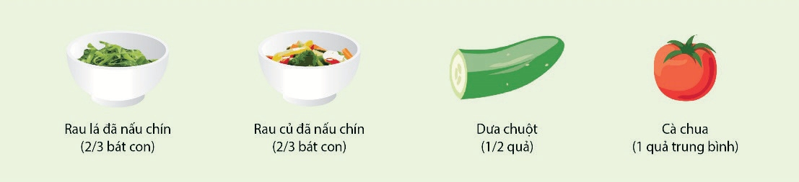
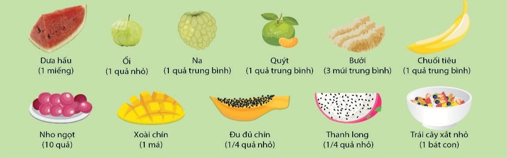

## 2.2. Cách tính một đơn vị ăn rau lá, rau củ quả

Một đơn vị ăn rau lá, rau củ quả tương đương với 80g rau lá, củ quả:
- 80g rau lá (rau muống, rau dền, rau mùng tơi, rau bắp cải...).
- 80g củ quả (1/2 quả dưa chuột cỡ trung bình, 1 quả cà chua cỡ trung
bình...).
- 1/2 bát rau lá đã nấu chín.
- 1/3 bát rau củ đã nấu chín

Một đơn vị ăn trái cây/ quả chín bằng 80g trái cây/ quả chín tương đương với:
- 1 miếng dưa hấu.
- 1 quả ổi cỡ nhỏ.
- 1 quả na, 1 quả quýt, 1 quả chuối tiêu cỡ trung bình.
- 3 múi bưởi cỡ trung bình
- 8 quả nho ngọt.
- 1 má xoài chín.
- 1/4 quả đu đủ chín, 1/4 quả thanh long cỡ nhỏ.
- 1 bát con trái cây xắt nhỏ.