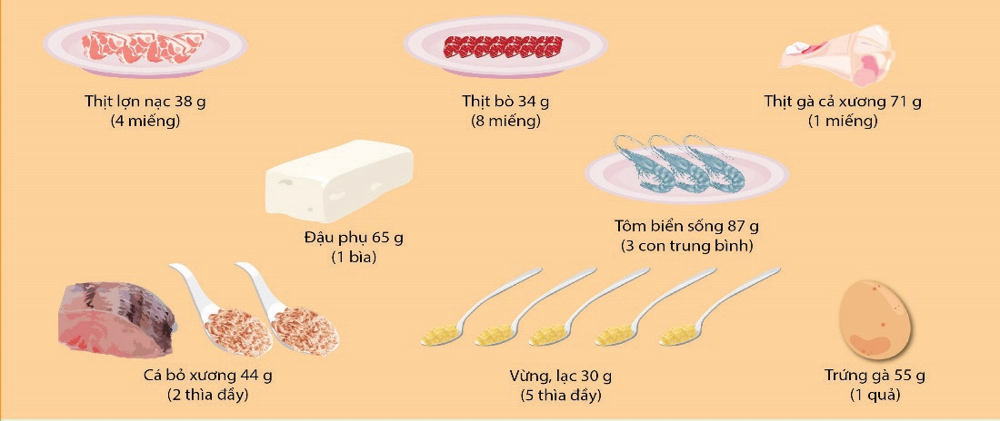

## 2.3. Cách tính một đơn vị ăn thịt, thủy sản, trứng và các hạt giàu đạm

Một đơn vị ăn thịt, thủy sản, trứng và các hạt giàu đạm cung cấp 7g
protein tương đương:
- 4 miếng thịt lợn nạc có trọng lượng bằng 38g.
- 8 miếng thịt bò thái mỏng có trọng lượng bằng 34g.
- 1 miếng thịt gà cả xương có trọng lượng bằng 71g.
- 1 bìa đậu phụ có trọng lượng bằng 65g.
- 3 con tôm biển sống có trọng lượng bằng 87g.
- 1 khúc cá đã bỏ xương có trọng lượng bằng 44g.
- 5 thìa cà phê đầy muối vừng có trọng lượng bằng 30g.
- 1 quả trứng gà có trọng lượng bằng 55g, 1 quả trứng vịt cỡ trung bình có trọng lượng bằng 60g, 5 quả trứng chim cút có trọng lượng bằng 60g.