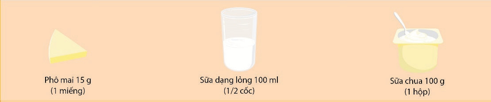
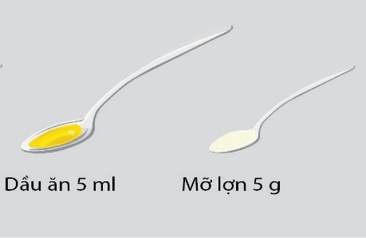
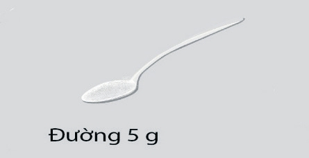
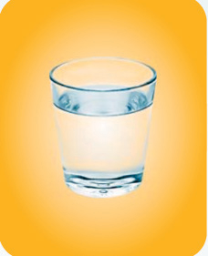

## 2.4. Cách tính một đơn vị ăn sữa và chế phẩm sữa

Một đơn vị ăn sữa và chế phẩm sữa cung cấp 100mg canxi tương đương:
- 1 miếng phô mai có trọng lượng bằng 15g.
- 1 cốc sữa dạng lỏng 100ml.
- 1 hộp sữa chua 100g.
## 2.5. Cách tính một đơn vị ăn dầu/mỡ

Một đơn vị ăn dầu/mỡ tương đương với 5g mỡ (1 thìa 2,5ml mỡ đầy) hoặc tương đương với 5ml dầu ăn (1 thìa 5ml dầu ăn).
## 2.6. Cách tính một đơn vị ăn đường

Một đơn vị ăn đường tương đương với 5g đường (1 thìa 2,5ml đường đầy).
## 2.7. Cách tính một đơn vị ăn muối
Một đơn vị ăn muối tương đương với 1g muối (1 thìa nhỏ 1g muối, 1 thìa nhỏ 1,5g bột canh hoặc 1 thìa 5ml nước mắm).
## 2.8. Cách tính một đơn vị nước

Một đơn vị nước tương đương với 1 cốc 200ml