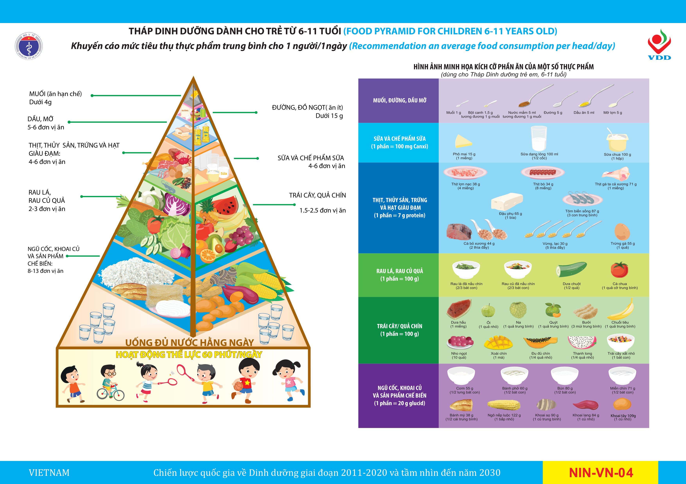

### 3.3.4. Hướng dẫn, tư vấn chế độ ăn phù hợp với lứa tuổi
#### » Nguyên tắc dinh dưỡng
- Ăn đa dạng các nhóm thực phẩm, tập cho trẻ ăn nhiều loại thực phẩm, món ăn.
- Chế độ ăn đáp ứng nhu cầu năng lượng, cân đối giữa các chất sinh năng lượng, đáp ứng nhu cầu về vitamin và chất khoáng theo lứa tuổi.
- Phối hợp bữa ăn ở trường và ở nhà phù hợp để tránh thiếu hoặc thừa năng lượng và các chất dinh dưỡng.
- Giáo dục dinh dưỡng cho trẻ em giúp trẻ nhận biết về các nhóm thực phẩm, vai trò thực phẩm, thực phẩm lành mạnh và không lành mạnh, tháp dinh dưỡng cho trẻ từ 6 - 11 tuổi.
#### » Lựa chọn thực phẩm
Sử dụng số lượng và định lượng thực phẩm theo tháp dinh dưỡng cho trẻ 6 - 11 tuổi.

