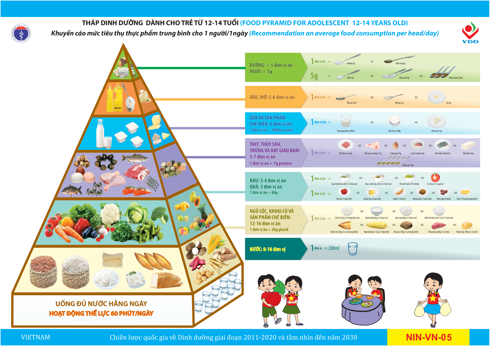

### 3.4.4. Hướng dẫn, tư vấn chế độ ăn phù hợp với lứa tuổi
#### » Nguyên tắc dinh dưỡng
- Ăn đa dạng các nhóm thực phẩm, đa dạng món ăn.
- Chế độ ăn đáp ứng nhu cầu năng lượng, cân đối giữa các chất sinh năng lượng, đáp ứng nhu cầu về vitamin và chất khoáng theo lứa tuổi.
- Phối hợp bữa ăn ở trường và ở nhà phù hợp để tránh thiếu hoặc thừa năng lượng và các chất dinh dưỡng.
- Giáo dục dinh dưỡng giúp trẻ nhận thức và ăn đúng ăn đủ các đơn vị ăn của tháp dinh dưỡng cho trẻ từ 12-14 tuổi; thực phẩm lành mạnh và không lành mạnh.
- Hạn chế thực phẩm không lành mạnh.
#### » Lựa chọn thực phẩm
Số lượng và định lượng theo tháp dinh dưỡng dành cho trẻ 12 - 14 tuổi như sau:

#### Hình 3: Tháp dinh dưỡng cho trẻ từ 12 - 14 tuổi

***a) Tầng thứ 1 của tháp: Ngũ cốc, khoai củ và sản phẩm chế biến***
- Trẻ 12 - 14 tuổi cần ăn trung bình 12 - 16 đơn vị ăn ngũ cốc, khoai củ và sản phẩm chế biến trong một ngày. Trong mỗi bữa ăn nên có sự phối hợp giữa ngũ cốc và khoai củ.

***b) Tầng thứ 2 của tháp: Rau lá, rau củ quả và trái cây/quả chín***
- Trẻ 12 - 14 tuổi cần ăn trung bình 3 - 4 đơn vị ăn rau lá, rau củ quả trong một ngày, nên sử dụng đa dạng các loại rau củ sẵn có tại địa phương.
- Trẻ 12 - 14 tuổi cần ăn trung bình 3 đơn vị ăn trái cây/quả chín trong một ngày. Mỗi loại trái cây/ quả chín cung cấp các vitamin và khoáng chất khác nhau vì vậy cần cho trẻ ăn phối hợp nhiều loại trái cây/quả chín để bổ sung nhiều loại vitamin và chất khoáng cho cơ thể.

***c) Tầng thứ 3 của tháp: Thịt, thủy sản, trứng, sữa, chế phẩm sữa và các hạt giàu đạm***
- Mỗi ngày mỗi trẻ nên ăn trung bình 5 - 7 đơn vị ăn. Mỗi bữa ăn nên có 2 - 3 loại thực phẩm và cần phối hợp giữa protein động vật và thực vật. Mỗi ngày nên có một món ăn từ thủy sản như tôm, cua, cá, trai, hến, sò, ngao, mực... để bổ sung canxi và các chất khoáng cho cơ thể.
- Trẻ 12 - 14 tuổi cần sử dụng trung bình 6 đơn vị ăn sữa và chế phẩm sữa trong một ngày. Cần cho trẻ sử dụng đồng thời cả 3 sản phẩm sữa dạng lỏng, sữa chua và phô mai. Nên sử dụng sữa dạng lỏng, sữa chua ít đường hoặc không đường. Với trẻ bị thừa cân, béo phì nên sử dụng sữa dạng lỏng, sữa chua, phô mai không chỉ ít đường mà còn ít chất béo. Trong trường hợp trẻ không dung nạp đường lactose thì nên tập cho trẻ uống sữa dần dần, hoặc thay thế bằng sữa chua và phô mai.

***d) Tầng thứ 4 của tháp: Dầu mỡ***
- Trẻ 12 - 14 tuổi nên sử dụng trung bình 5 - 6 đơn vị ăn dầu, mỡ/ ngày. Bữa ăn cần phối hợp chất béo thực vật (dầu thực vật) và chất béo động vật (mỡ, bơ) để cung cấp nhiều loại acid béo khác nhau cho cơ thể.

***e) Tầng thứ 5 của tháp: Hạn chế tiêu thụ đường***
- Trẻ 12 - 14 tuổi nên sử dụng tối đa dưới 25g đường mỗi ngày (ít hơn 5 đơn vị ăn mỗi ngày). Không nên cho trẻ ăn các thực phẩm có nhiều đường như các loại bánh, mứt, kẹo, kem và nước ngọt...

***f) Tầng thứ 6 (đỉnh tháp): Hạn chế tiêu thụ muối***
- Trẻ 12 - 14 tuổi nên ăn dưới 5g muối một ngày, sử dụng muối i-ốt để phòng các rối loạn do thiếu i-ốt.

***g) Tầng đáy***: Uống đủ nước, lượng nước tiêu thụ: 1,6 - 2 lít/ngày