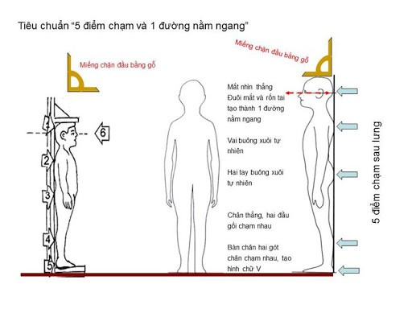

# 3. Kỹ thuật cân, đo và tính tuổi

## 3.1. Kỹ thuật cân

- **Cân**: Dùng cân điện tử hoặc cân đồng hồ với sai số <100g.
- **Chuẩn bị cân**: Đặt cân ở vị trí ổn định và bằng phẳng. Chỉnh cân về vị trí cân bằng ở số 0. Kiểm tra cân trước và trong khi sử dụng cụ. Nên dán hình bàn chân lên cân để giúp trẻ đặt bàn chân ở đúng vị trí khi cân.
- **Chuẩn bị cho trẻ cân**: Trẻ mặc quần áo nhẹ, không mang giày dép; lấy khỏi người các vật dụng trong túi như đồ ăn, đồ chơi,... để cân được chính xác.
- **Thực hiện cân**: Cho trẻ đứng 2 chân đều giữa mặt cân. Đứng yên đến khi số cân hiện cố định. Ghi số cân nặng tính bằng kg.

## 3.2. Kỹ thuật đo chiều cao

- **Thước đo chiều cao**: Dùng thước gỗ chuyên dụng hoặc thước đo chiều cao chuẩn gắn cố định. Khi cố định, thước phải thẳng và vuông góc với sàn nhà và vạch số 0 sát sàn nhà.
- **Hiệu chỉnh thước**: Kiểm tra thước trước khi đo để đảm bảo thước thẳng, vuông góc với sàn nhà, vạch số 0 sát sàn nhà.
- **Chuẩn bị đo**: Trẻ được đo không đội mũ, không mang giày dép, tháo buộc tóc.
- **Thực hiện đo**: Trẻ đứng thẳng đứng quay lưng với thước đo, sát tường sao cho có 5 điểm chạm tường: 1) Gót chân; 2) Bắp chân; 3) Mông; 4) Bờ sau vai; 5) Phía sau gáy. Hai gót chân chụm lại hình chữ V, mắt nhìn thẳng, hai tay thả lỏng. Kéo thước áp sát đỉnh đầu, vuông góc với thước đo. Mắt của người đo nhìn ngang tầm và trực diện vào vạch của thước - nơi tiếp xúc giữa thước và đỉnh đầu. Kết quả được ghi theo đơn vị cm với 1 số lẻ (0,0cm).

