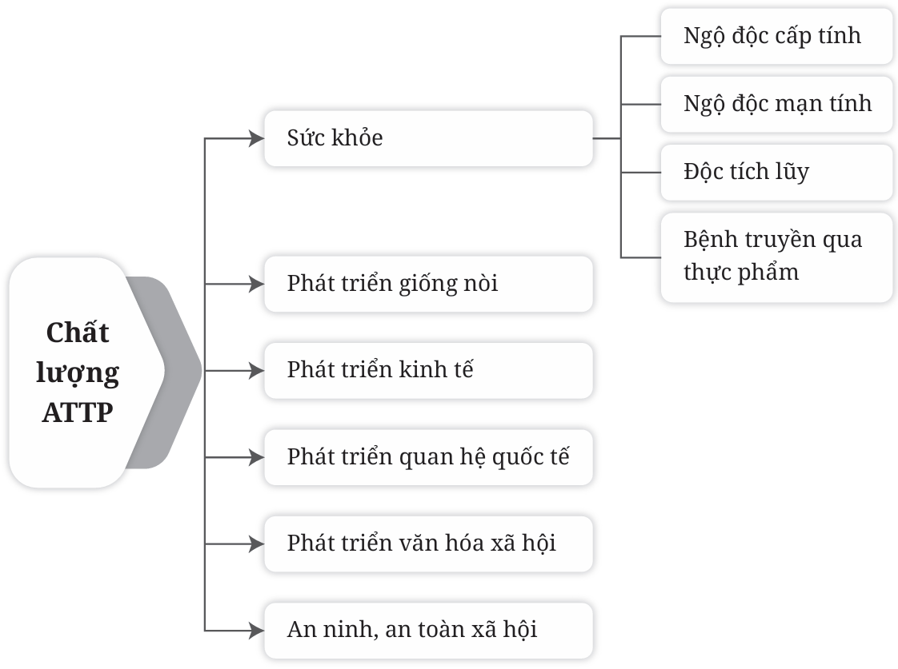

# 1. TẦM QUAN TRỌNG CỦA CÔNG TÁC ĐẢM BẢO AN TOÀN THỰC PHẨM TRƯỜNG HỌC

## 1.1. Tầm quan trọng của thực phẩm và an toàn thực phẩm trong trường học

Học sinh là thế hệ tương lai của đất nước, do đó việc đảm bảo sức khỏe của học sinh là trách nhiệm của toàn xã hội. Hiện nay, an toàn thực phẩm trong cơ sở giáo dục chưa bảo đảm, có nhiều học sinh bị ngộ độc thực phẩm tại trường học gây ảnh hưởng lớn tới an ninh, an toàn thực phẩm nói chung và sức khỏe của các em học sinh nói riêng. Vì vậy, đảm bảo an toàn thực phẩm tại cơ sở giáo dục là vấn đề vô cùng quan trọng, vừa cấp bách, vừa lâu dài, tác động, ảnh hưởng trực tiếp đến sức khoẻ và sự phát triển thể chất của trẻ em, học sinh.

Thực phẩm là nguồn cung cấp các chất dinh dưỡng và năng lượng hàng ngày cho cơ thể, giúp cơ thể khỏe mạnh, chống lại các nguy cơ bệnh tật. Nếu thực phẩm không đảm bảo vệ sinh sẽ không cung cấp đủ các chất dinh dưỡng cần thiết cho cơ thể, đặc biệt là lứa tuổi học sinh, lứa tuổi cần đảm bảo dinh dưỡng cho sự phát triển toàn diện về thể chất và tinh thần. Ngoài ra, trẻ em là nhóm dễ mắc các vấn đề về đường tiêu hóa như tiêu chảy, ngộ độc thực phẩm,...

Bên cạnh đó, ngoài ảnh hưởng tức thì, sử dụng thực phẩm không đảm bảo an toàn vệ sinh lâu ngày cũng dẫn đến tích lũy các chất độc hại ở một số cơ quan trong cơ thể, gây ảnh hưởng đến sức khỏe và giống nòi.

