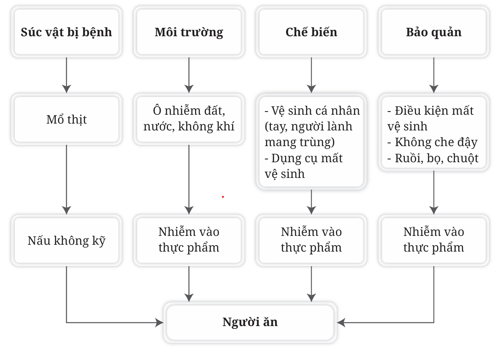

## 2.2. Các loại ngộ độc thực phẩm

Căn cứ vào tác nhân gây ngộ độc thực phẩm chia ngộ độc thực phẩm làm 4 loại sau:

### 2.2.1. Ngộ độc thực phẩm do tác nhân sinh học

***Đường lây nhiễm vi sinh vật vào thực phẩm*** 

- Môi trường bị ô nhiễm: vi sinh vật từ đất, nước, không khí, dụng cụ và các vật dụng khác nhiễm vào thực phẩm.

- Do thiếu vệ sinh trong quá trình chế biến, vệ sinh cá nhân không đảm bảo (tay người chế biến không sạch, người lành mang vi trùng...) làm nhiễm vi sinh vật vào thực phẩm. Thức ăn nấu không kỹ, ăn thức ăn sống (gỏi, lẩu...) cũng bị nhiễm vi sinh vật, gây ngộ độc.

- Do bảo quản thực phẩm không đảm bảo vệ sinh, không che đậy để côn trùng, vật nuôi... tiếp xúc vào thức ăn, làm lây nhiễm vi sinh vật gây bệnh.

- Do bản thân thực phẩm, gia súc, gia cầm đã bị bệnh trước khi giết mổ, khi chế biến, nấu nướng không bảo đảm giết chết được hết các mầm bệnh. Hiện nay, đang xuất hiện nhiều hiện tượng buôn bán thịt lợn chết bệnh để chế biến thành xúc xích, lạp sườn, gây tác hại nghiêm trọng cho sức khoẻ người tiêu dùng. Ngoài ra, do quá trình giết mổ, vận chuyển, bảo quản, chế biến không đảm bảo an toàn vệ sinh, cũng có thể gây nhiễm vi sinh vật vào thực phẩm mặc dù gia súc, gia cầm trước khi giết mổ khoẻ mạnh, không có bệnh tật.

Tóm tắt các con đường nhiễm vi sinh vật vào thực phẩm gây ngộ độc cho người ăn được thể hiện ở hình 2.

