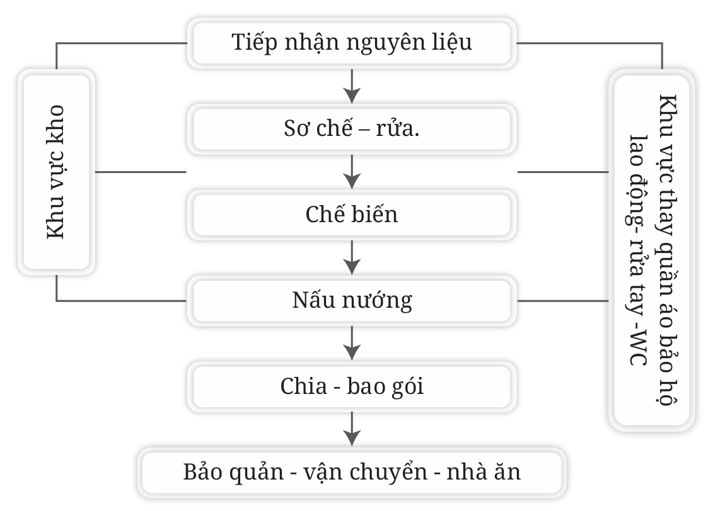

### 4.1.6. Kiểm soát nơi ăn

- Nhà ăn phải đảm bảo đủ điều kiện về cơ sở, dụng cụ thiết bị và con người phục vụ.

- Người ăn phải rửa tay sạch sẽ trước khi ăn. Trong khi ăn không nói to, đi lại lộn xộn, giữ đúng quy định, chế độ nhà ăn tập thể.

- Trước khi vào phòng ăn, có tiền phòng để mũ, nón, treo áo mưa, áo khoác, chỗ rửa tay, phòng vệ sinh...

- Phòng ăn có bàn, ghế ngồi thông thoáng.

Các khâu phải được kiểm soát chặt chẽ được thể hiện ở sơ đồ hình 9:

